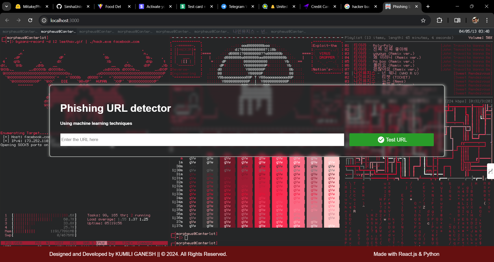

# Designed and Developed by KUMILI GANESH
## PhishingURLdetector
A machine learning app where user can enter a URL and determine if it is real or fake (up to 98% accuracy)


## How to run?
 1. First Clone the repo 
 ```
git clone https://github.com/ganesh2925/Phishing_URL_Detector_With_ML_And_ReactJS.git
```
 3. Open the project in VS code and select api folder 
 ```
cd api
```
 5. Run 
 ```
python api.py
```
 7. Open the client folder 
 ```
cd client
```
 9. Run this command to install the dependency.
 ```
npm i
```
 10. Next Run this command to access the front end.
 ```
npm start
```
 12. Enter the URL in the input field and click Test URL to get the result.
 13. The result will be displayed on the web page.

<br />

# The Front-End design Looks like this:-




# Back-End (Flask) API Code:-


# Machine learning (ML) Model accuracy:-


